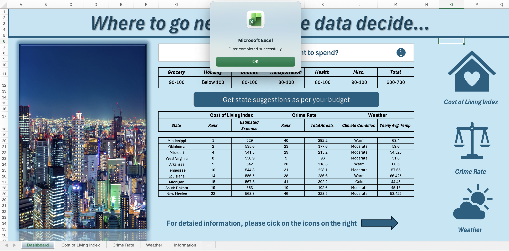
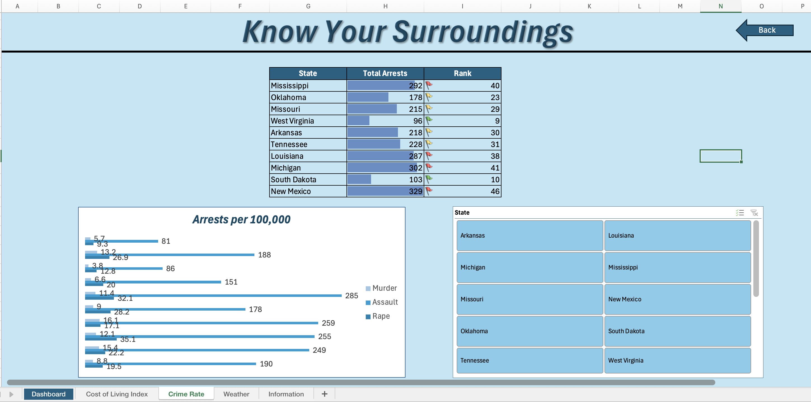
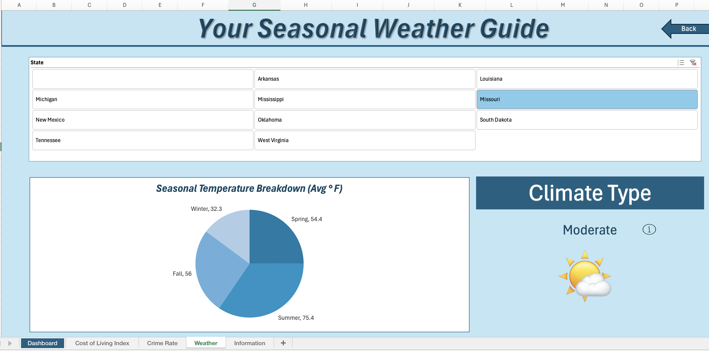

# 🏙️ City Selection Decision Dashboard (Excel VBA)

## 📌 Overview
This project is an **Excel-based decision-support dashboard** designed to help users choose the most suitable city after receiving a job offer.  
Rather than performing complex statistical analysis within Excel, the dashboard focuses on **simplicity, usability, and automation**, allowing users to arrive at a **final city recommendation** by setting their personal preferences.

The workbook integrates **existing datasets for cost of living, crime rate, and climate**, and uses **Excel formulas, data validation, and VBA macros** to translate user inputs into a clear final outcome.

---

## 🎯 Objective
The objective of this dashboard is to:
- Reduce decision complexity when comparing cities
- Allow users to define **acceptable expense and comfort brackets**
- Automatically reflect those preferences in the final city outcome
- Deliver a **clean, intuitive recommendation** without manual calculations

---

## 🧩 Dashboard Components and Logic

### 💸 Cost of Living (User-Defined Expense Brackets)
Instead of computing cost metrics manually, the dashboard allows the user to **select how much they are willing to spend** across different living expense parameters.

Users choose predefined **expense brackets** (for example: Low, Medium, High), which are controlled using **Excel Data Validation drop-downs**.  
Based on these selections:
- The dashboard pulls corresponding values from the cost-of-living dataset
- Cities outside the selected affordability range are implicitly deprioritized
- Calculations update automatically in the background

**Techniques used within this component:**
- Data Validation drop-downs for expense brackets
- Lookup formulas to map bracket choices to data
- Automated recalculation triggered by VBA macros

---

### 🚨 Crime Rate (Safety Preference Integration)
Crime data is incorporated as a **decision filter**, not a standalone analysis.

The user’s tolerance for crime levels is reflected implicitly through:
- Category-based interpretation of crime data
- Pre-structured lookup logic that feeds into the final outcome
- Automatic updates when the user changes preferences

**Built-in logic includes:**
- Standardized crime metrics from the dataset
- Conditional logic to reflect acceptable vs non-acceptable ranges
- Seamless integration into the final decision output

No manual scoring is required from the user.

---

### 🌤 Climate (Comfort-Oriented Selection)
Climate data is included to improve **living comfort alignment**.

Rather than presenting raw weather statistics, the dashboard:
- Uses average climate indicators from the dataset
- Maps them into simplified comfort groupings
- Updates results dynamically based on user choices

This keeps the interface intuitive while still using real data behind the scenes.

---

## 🔄 Automation and User Experience
The dashboard is designed so that **the user never interacts with raw data sheets**.

VBA macros are embedded throughout the workflow to:
- Reset user selections
- Refresh dashboard calculations
- Navigate directly to the dashboard view
- Ensure smooth interaction after each input change

Macros work in combination with Excel formulas so the user experiences **instant feedback**.

---

## 🛡️ Data Validation for Simplicity and Accuracy
Data Validation is intentionally embedded within each decision component to:
- Restrict inputs to predefined brackets and choices
- Prevent incorrect or inconsistent entries
- Ensure outputs always remain interpretable

This design allows non-technical users to interact with the dashboard confidently.

---

## 📊 Final Output
Based on user-defined preferences across:
- Living expense tolerance
- Safety considerations
- Climate comfort

the dashboard produces a **final recommended city outcome** that aligns with those constraints.

The emphasis is on **decision clarity**, not analytical complexity.

---

## 🛠 Tools & Skills Demonstrated
- Microsoft Excel (.xlsm)
- VBA Macros for automation and navigation
- Excel Data Validation
- Lookup-based decision logic
- Dashboard design for decision support
- User-centric analytics presentation

---

## 💡 Key Takeaway
This project demonstrates how Excel can be effectively used as a **decision-support system**, not just a spreadsheet. By combining structured datasets with guided user inputs, the dashboard transforms complex relocation considerations into a clear, actionable outcome.

- Problem Simplification: Converted a multi-factor relocation decision into a structured, guided workflow that reduces cognitive load for the user.

- User-Centric Design: Replaced raw numerical inputs with predefined brackets to improve decision clarity and prevent invalid assumptions.

- Operational Efficiency: Leveraged VBA macros to automate repetitive steps, enabling faster and more reliable decision cycles.

- Scalable Framework: Designed a reusable Excel-based decision model that can be extended to additional cities, factors, or compensation scenarios.

## ⬇️ Download the Excel Dashboard

You can download the original macro-enabled Excel dashboard here:

If the link does not open directly, click the file in the repository and choose **Download**.

